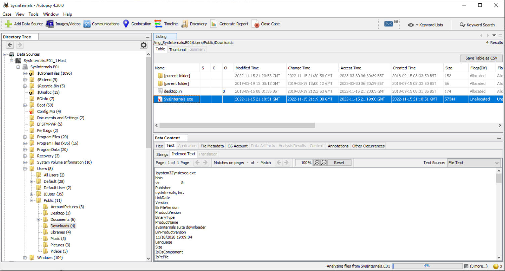
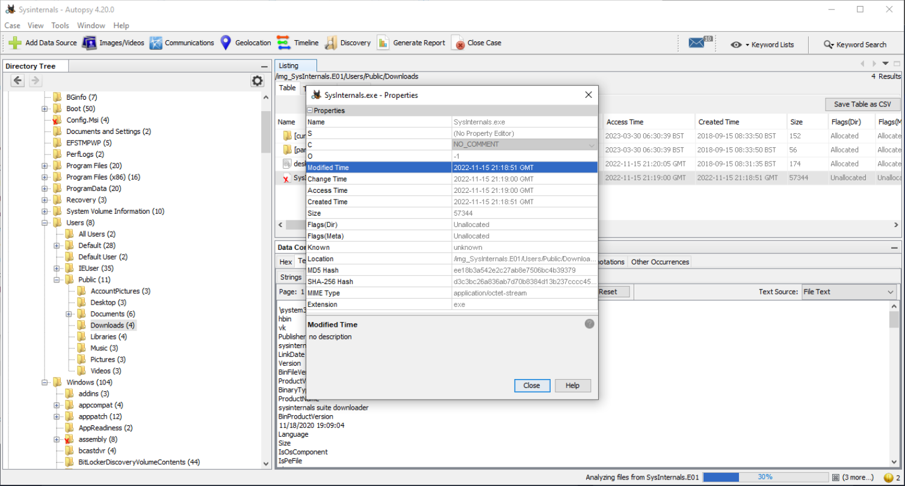
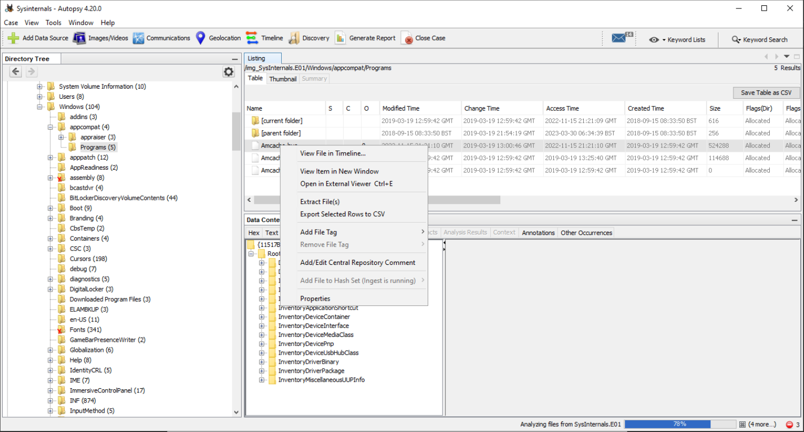
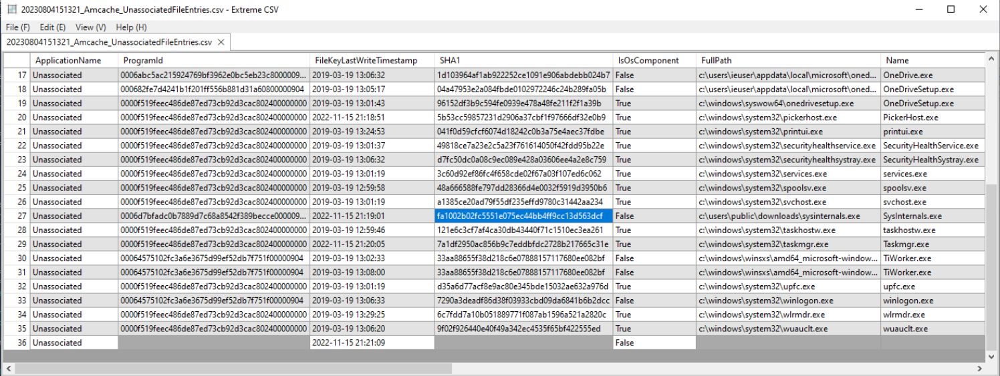
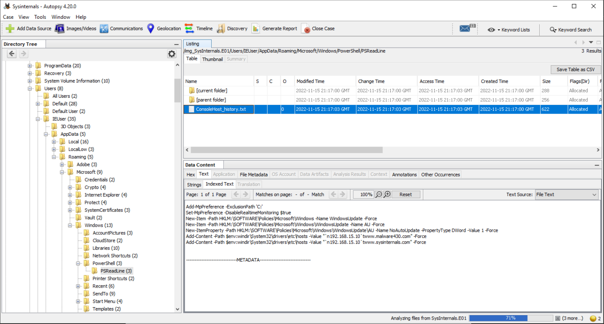
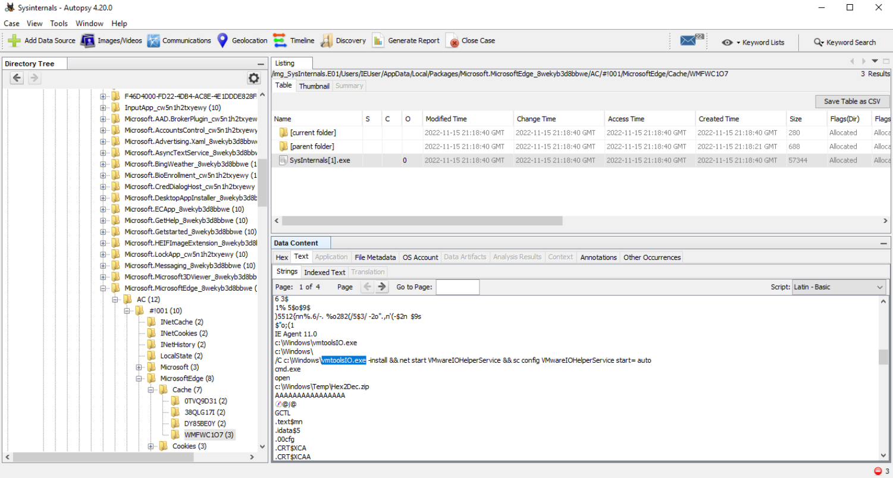
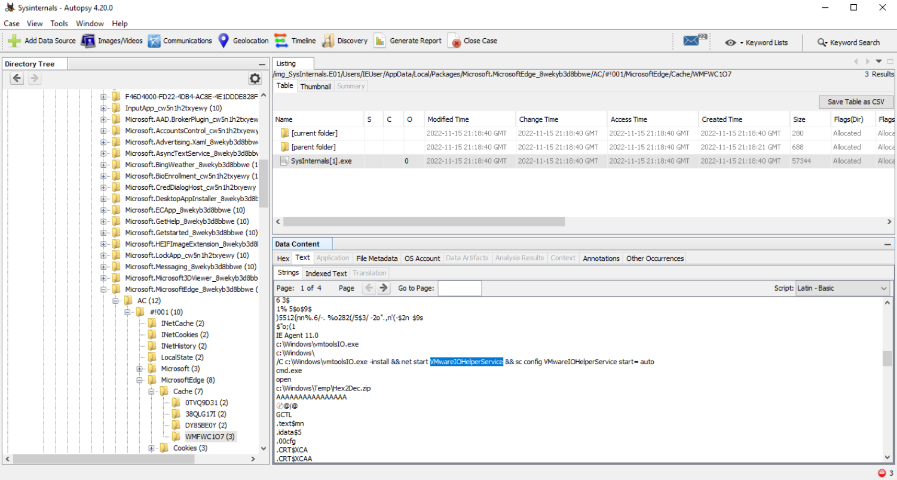

# Sysinternals

## Scenario

[Cyber Defenders Sysinternals challenge](https://cyberdefenders.org/blueteam-ctf-challenges/100): A user thought they were downloading the SysInternals tool suite and attempted to open it, but the tools did not launch and became inaccessible. Since then, the user has observed that their system has gradually slowed down and become less responsive.

## Tools

* [Eric Zimmerman's Tools](https://ericzimmerman.github.io/#!index.md) (Registry Explorer, Event Log Explorer, AppCompatCachParser)
* VirusTotal
* Web Cache View
* FTK Imager
* [Autopsy](https://testlab.tymyrddin.dev/docs/dfir/autopsy-windows)

----

## Questions

Q1 What was the malicious executable file name that the user downloaded?

Q2 When was the last time the malicious executable file was modified? 12-hour format

Q3 What is the SHA1 hash value of the malware?

Extract `/img_SysInternals.E01/Windows/appcompat/Programs/Amcache.hve`.

Then use Zimmerman's AmcacheParser:

    .\AmcacheParser.exe -f "F:\Tmp\Amcache.hve" --csv F:\Tmp

Q4 What is the malware's family?

[VirusTotal family labels](https://www.virustotal.com/gui/file/72e6d1728a546c2f3ee32c063ed09fa6ba8c46ac33b0dd2e354087c1ad26ef48/detection)

Q5 What is the first mapped domain's Fully Qualified Domain Name (FQDN)?

[VirusTotal FQDM most detected](https://www.virustotal.com/gui/file/72e6d1728a546c2f3ee32c063ed09fa6ba8c46ac33b0dd2e354087c1ad26ef48/relations)

Q6 The mapped domain is linked to an IP address. What is that IP address?

Q7 What is the name of the executable dropped by the first-stage executable?

Q8 What is the name of the service installed by 2nd stage executable?

Q9 What is the extension of files deleted by the 2nd stage executable?

Nasty, nasty question. Either run the sample in a sandbox, or search for the answer on the internet in analysis reports of the malware. pf.
