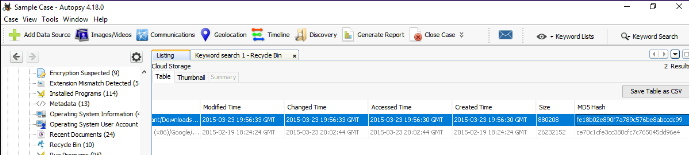

| 
|:--:|
| [THM Rooms: Autopsy (1 and 2)](https://tryhackme.com/room/autopsy2ze0) |

# Leaking private company data (again)

**What is the name of an Installed Program with the version number of 6.2.0.2962?**

| 
|:--:|
| Answer: `Eraser` |

**A user has a Password Hint. What is the value?**

| 
|:--:|
| Answer: `IAMAN` |

**Numerous SECRET files were accessed from a network drive. What was the IP address?**

| 
|:--:|
| Answer: `10.11.11.128` |

**What web search term has the most entries?**

| 
|:--:|
| Answer: `information leakage cases` |

**What was the web search conducted on 3/25/2015 21:46:44?**

| 
|:--:|
| Answer: `anti-forensic tools` |

**What MD5 hash value of the binary is listed as an Interesting File?**

| 
|:--:|
| Answer: `fe18b02e890f7a789c576be8abccdc99` |

**What self-assuring message did the 'Informant' write for himself on a Sticky Note? (no spaces)**

| 
|:--:|
| Answer: `Tomorrow... Everything will be OK...` |

**Using the Timeline, how many results were there on 2015-01-12?**

| 
|:--:|
| Answer: `46` |

**The majority of file events occurred on what date? (MONTH DD, YYYY)**

| 
|:--:|
| Answer: `March 25,2015` |

## Resources

* [Autopsy User Documentation](https://sleuthkit.org/autopsy/docs/user-docs/4.12.0/ds_page.html)

