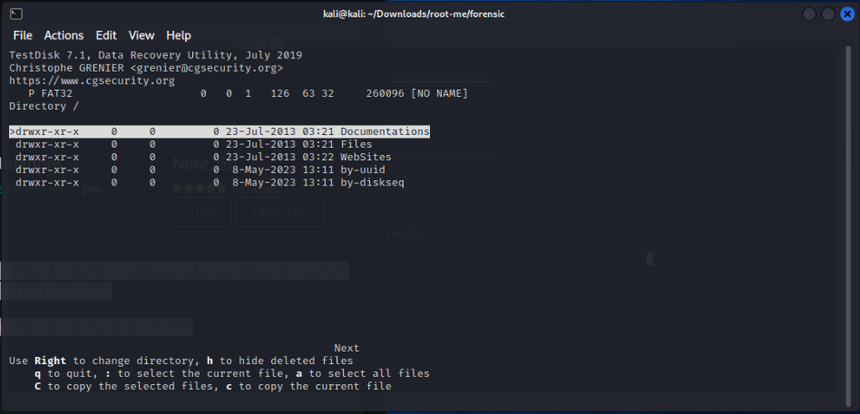
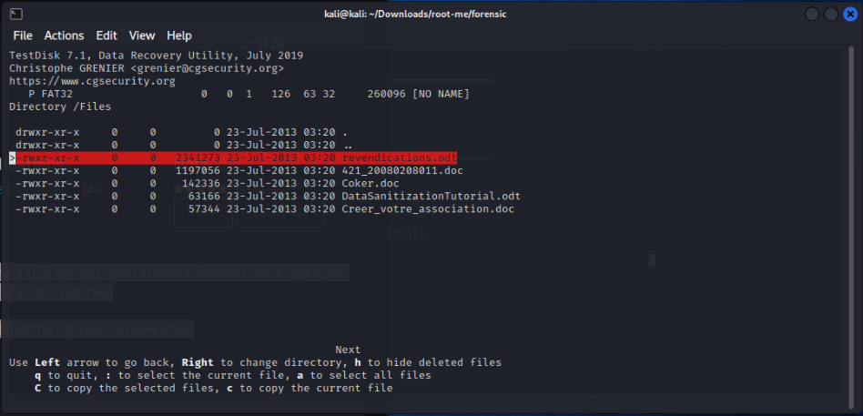
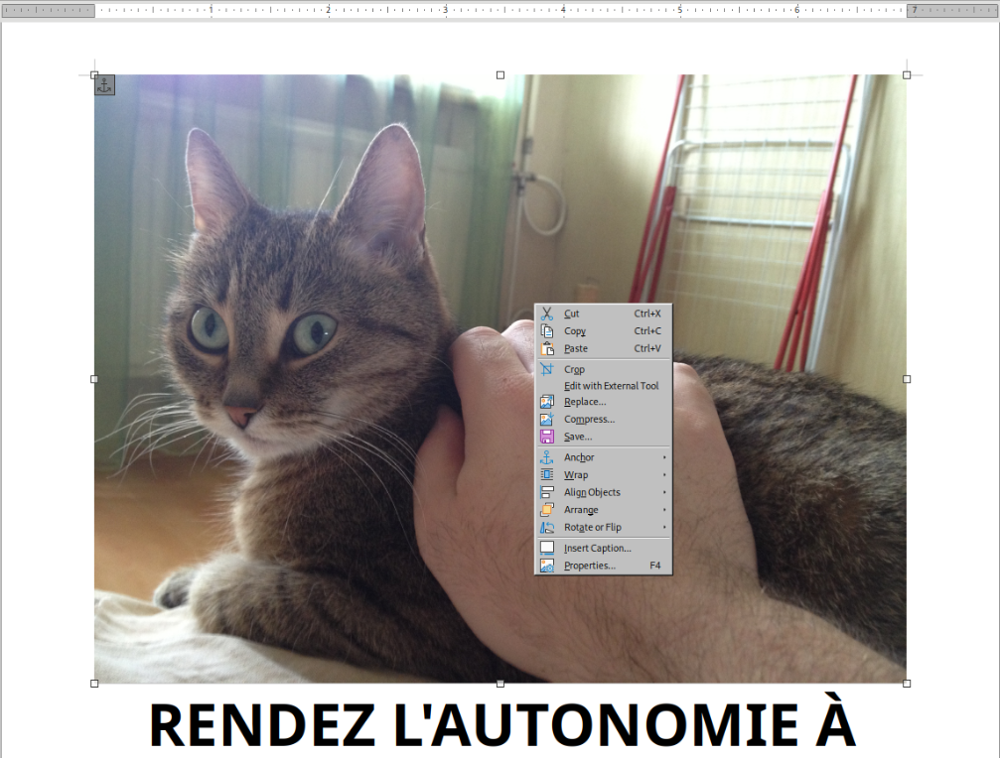

# Find the cat

[root-me challenge](https://www.root-me.org/en/Challenges/Forensic/Find-the-cat): The president’s cat was kidnapped by separatists. A suspect carrying a USB key has been arrested. Berthier, once again you have to save the Republic! Analyze this key and find out in which city the cat is retained!

The md5sum of the archive is `edf2f1aaef605c308561888079e7f7f7`. Input the city name in lowercase.

----

What is it?

```text
┌──(kali㉿kali)-[~/Downloads/root-me/forensic]
└─$ file chall9
chall9: DOS/MBR boot sector; partition 1 : ID=0xb, start-CHS (0x0,32,33), end-CHS (0x10,81,1), startsector 2048, 260096 sectors, extended partition table (last)
```

```text
┌──(kali㉿kali)-[~/Downloads/root-me/forensic]
└─$ fdisk -l chall9
Disk chall9: 128 MiB, 134217728 bytes, 262144 sectors
Units: sectors of 1 * 512 = 512 bytes
Sector size (logical/physical): 512 bytes / 512 bytes
I/O size (minimum/optimal): 512 bytes / 512 bytes
Disklabel type: dos
Disk identifier: 0xc5ce543f

Device     Boot Start    End Sectors  Size Id Type
chall9p1         2048 262143  260096  127M  b W95 FAT32
```

Write the partition as separate image.

```text
┌──(kali㉿kali)-[~/Downloads/root-me/forensic]
└─$ dd if=chall9 of=chall9_p1 bs=512 skip=2048 count=260096
```

Mount the image:

```text
┌──(kali㉿kali)-[~/Downloads/root-me/forensic]
└─$ sudo mount chall9_p1 /dev/disk                         
[sudo] password for kali: 
                                                                                                                                  
┌──(kali㉿kali)-[~/Downloads/root-me/forensic]
└─$ ls /dev/disk
by-diskseq  by-uuid  Documentations  Files  WebSites
                                                                                                                                  
┌──(kali㉿kali)-[~/Downloads/root-me/forensic]
└─$ ls /dev/disk/Documentations 
 Barbey_Cigognes_BDC.pdf       'mangeur-de-cigogne (1).pdf'   m-flamm.pdf
 brasserie_jo_dinner_menu.pdf   mangeur-de-cigogne.pdf        tartes_flambee_a_volonte_francais_2013.pdf
 Courba13-01.pdf               'Menu AC.pdf'                  texte_migration_des_cigognes.pdf
 
┌──(kali㉿kali)-[~/Downloads/root-me/forensic]
└─$ sudo umount /dev/disk
```

Alas. Maybe deleted?

```text
┌──(kali㉿kali)-[~/Downloads/root-me/forensic]
└─$ testdisk chall9_p1
```





Copy (`C`) `revendications.odt`, and open it:



Save the graphics in the file as `cat.jpg`, use `exiftool cat.jpg` to get its `GPS Position`, and look up the name of the location.
