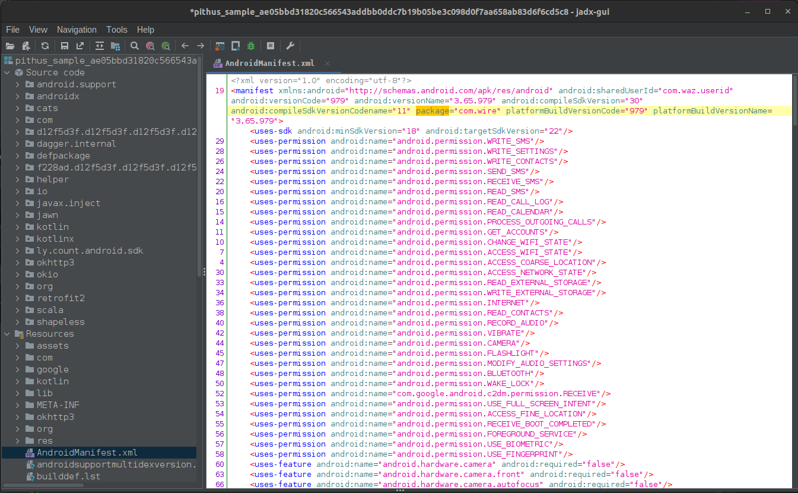
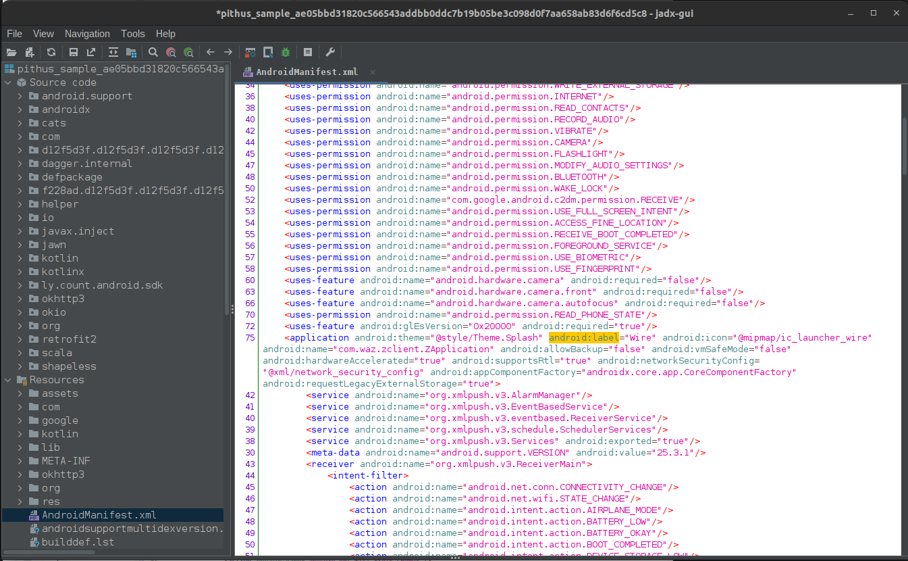

# Android malware analysis (jadx)

The [static analysis sample case study](../notes/mobile-analysis.md) in this room is a trojanised application ([download sample here](https://beta.pithus.org/report/ae05bbd31820c566543addbb0ddc7b19b05be3c098d0f7aa658ab83d6f6cd5c8)) of the secure chat application [Wire](https://wire.com/en/). 

Analysed locally with [jadx](https://testlab.tymyrddin.dev/docs/dfir/jadx).

----

Package name and version:

Application name:

Signing certificate information:

If permitted by your internal guidelines, you can search for the SHA256 of the sample on multiple online services such as VirusTotal.

Requested permissions:

Review the permissions and assess if these are legitimate permissions for the app's purpose. Instincts and gut feelings are worth investigating.

## Resources

* [Manifest.permission](https://developer.android.com/reference/android/Manifest.permission)
* [Permissions on Android](https://developer.android.com/guide/topics/permissions/overview)
* [Android app permissions explained and how to use them](https://www.androidauthority.com/app-permissions-886758/)
* [FinSpy spyware analysis](https://defensive-lab.agency/2020/09/finspy-android/)
