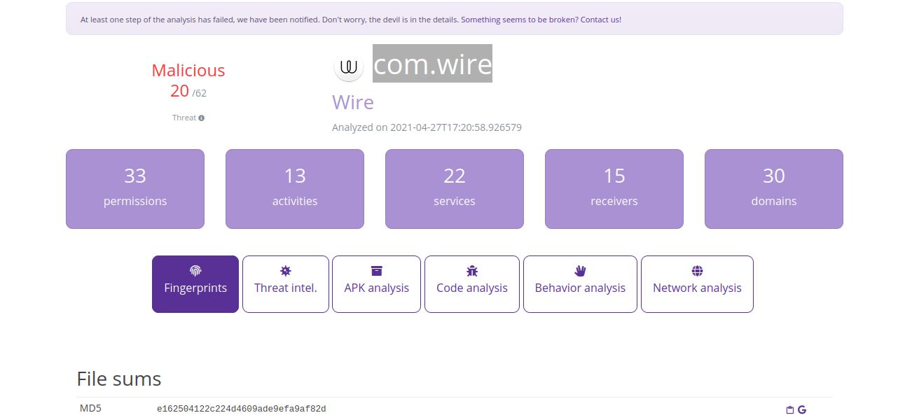
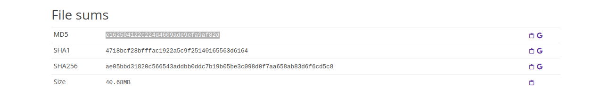
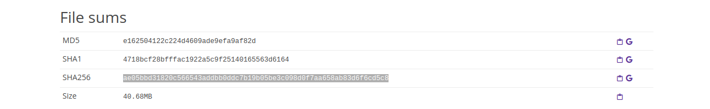
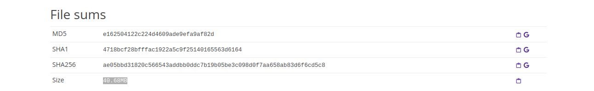
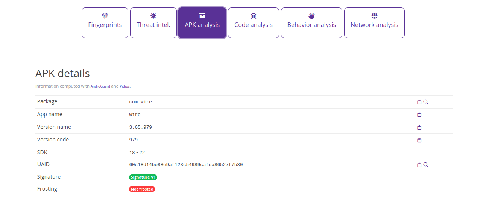
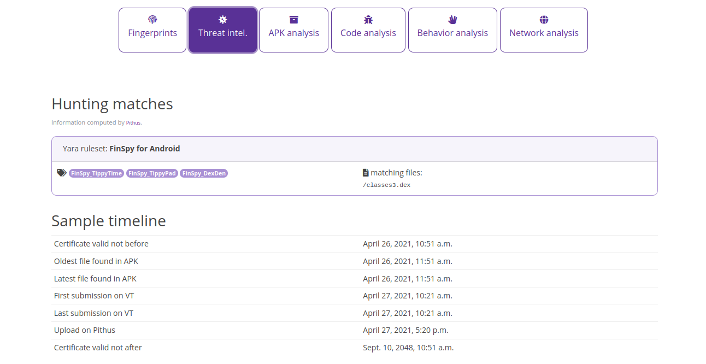
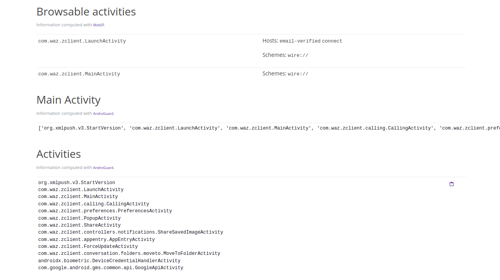
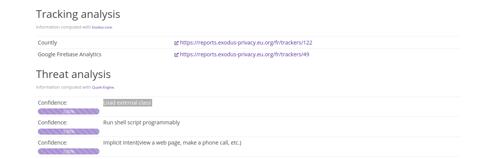
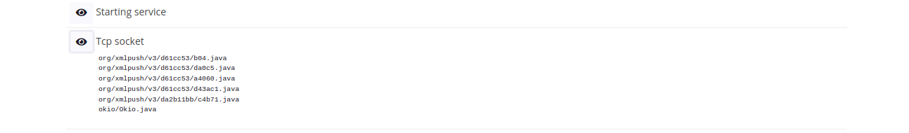
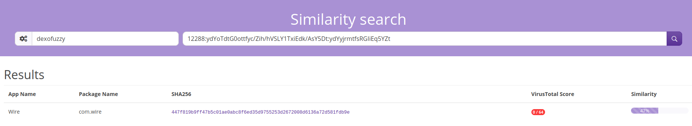

# Android malware analysis (Pithus)

The [static analysis sample case study](../notes/mobile-analysis.md) in this room is a trojanised application ([download sample here](https://beta.pithus.org/report/ae05bbd31820c566543addbb0ddc7b19b05be3c098d0f7aa658ab83d6f6cd5c8)) of the secure chat application [Wire](https://wire.com/en/). 

Analysed online with [Pithus](https://testlab.tymyrddin.dev/docs/dfir/pithus).

----

## First steps

Name package:



Hashes (MD5 and SHA256):





Size of the package:



## Getting into the APK



With some quick online research, we can find that [the 3.65.979 version was released on 1 March 2021](https://www.apkmirror.com/apk/wire-swiss-gmbh/wire/wire-3-65-979-release/wire-secure-messenger-3-65-979-android-apk-download/).



The X.509 certificate was created to work from 26 April 2021, and the oldest files from the samples were identified around that time. Two months after the release of the version of the legit APK. 

In the ***APK Analysis*** tab of Pithus, we can find the main activity for this application:



```text
['org.xmlpush.v3.StartVersion', 'com.waz.zclient.LaunchActivity', 'com.waz.zclient.MainActivity', 
'com.waz.zclient.calling.CallingActivity', 'com.waz.zclient.preferences.PreferencesActivity', 
'com.waz.zclient.PopupActivity', 'com.waz.zclient.ShareActivity', 
'com.waz.zclient.controllers.notifications.ShareSavedImageActivity', 
'com.waz.zclient.appentry.AppEntryActivity', 'com.waz.zclient.ForceUpdateActivity', 
'com.waz.zclient.conversation.folders.moveto.MoveToFolderActivity', 
'androidx.biometric.DeviceCredentialHandlerActivity', 'com.google.android.gms.common.api.GoogleApiActivity']
```

Activities:

```text
org.xmlpush.v3.StartVersion
com.waz.zclient.LaunchActivity
com.waz.zclient.MainActivity
com.waz.zclient.calling.CallingActivity
com.waz.zclient.preferences.PreferencesActivity
com.waz.zclient.PopupActivity
com.waz.zclient.ShareActivity
com.waz.zclient.controllers.notifications.ShareSavedImageActivity
com.waz.zclient.appentry.AppEntryActivity
com.waz.zclient.ForceUpdateActivity
com.waz.zclient.conversation.folders.moveto.MoveToFolderActivity
androidx.biometric.DeviceCredentialHandlerActivity
com.google.android.gms.common.api.GoogleApiActivity
```

**org.xmlpush.v3.StartVersion** stands out from the crowd. The Java method `org.xmlpush.v3.q.c.a()` is meant for reconfiguring SMS.

In the same tab, in the section on ***Manifest analysis***, three actions are triggered by this activity:


Check the ***Behavior Analysis*** tab: This APK is requesting an extensive amount of permissions. This might not be entirely suspicious, depending on what this application is doing. 

The ***Threat analysis*** section on that page is based on [Quark](https://github.com/quark-engine/quark-engine). The first crime identified:



And contains this unbelievable action (making it hard for a user to find the app in the menu):


The ***Behavior analysis*** section on the ***Behavior analysis*** tab contains ***Tcp sockets***:



Only `okio/Okio.java` is probably not malicious. The Okio library is built on top of Java's InputStream and OutputStream classes, and provides a higher-level API for working with these types of streams. It also includes support for working with other data sources, such as files, sockets, and in-memory data structures.

The ***Network Analysis*** tab shows domains that have been identified and are queried by the APK. More advanced malware will obfuscate the domain or IP it communicates to avoid detection, and in such cases this tab does not reveal much.

## Hunting

Continuing the research to find other samples that are identical or similar to the first sample. This can give an understanding of the type of victims being targeted and the Tactics, Techniques, and Procedures (TTPs) malicious actor(s) are using.

In the ***Fingerprints*** tab, scroll down to the ***SSdeep*** and ***Dexofuzzy*** results and click on the magnifying glass on the right. Dexofuzzy gives results, and the ***Threat Intel*** tab a little more, but the link to VirusTotal reveals vendors do not detect maliciousness in similar files.



Logging in, you can create Yara rules for hunting. Pithus only supports vanilla Yara for the moment. If you try to use modules, it will not work.

## Hunting 2

On the home page of Pithus, there is a query field available. The ***help*** button is essential.

For example, to hunt for the sha256 hash of the sample:

```text
sha256:ae05bbd31820c566543addbb0ddc7b19b05be3c098d0f7aa658ab83d6f6cd5c8
```

To hunt for the non-malicious class that was identified?

```text
java_classes:okio/okio
```

## Resources

* [FinSpy spyware analysis](https://defensive-lab.agency/2020/09/finspy-android/)
