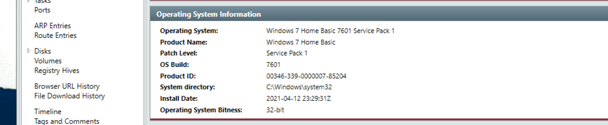
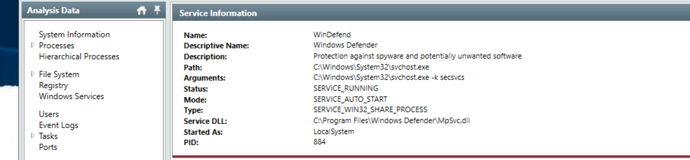
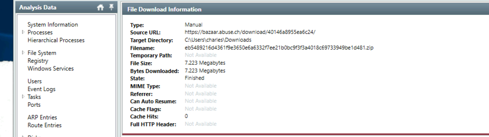
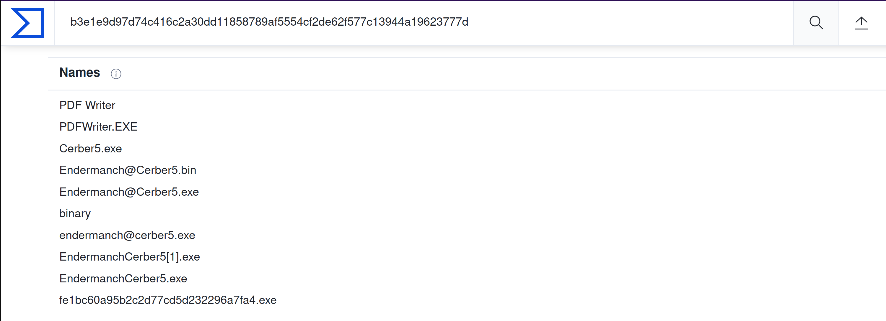

# Endpoint investigation (Redline)

Scenario: A Senior Accountant, Charles, is complaining that he cannot access the spreadsheets and other files he has been working on. He also mentioned that his wallpaper got changed with the saying that his files got encrypted. This is not good news!

Are you ready to perform the memory analysis of the compromised host? You have all the data you need to do some investigation on the victim's machine. Let's go hunting!

Task:

* Navigate to the folder on your desktop titled Endpoint Investigation.
* Double-click on the `AnalysisSession1.mans` file. The data will be imported automatically into Redline.
* Analyze the file to answer the questions below.

Note: Give it up to 10 minutes for all the data import.

## Questions

**Can you identify the product name of the machine?**

Go to `System Information`:

| 
|:--:|
| Answer: `Windows 7 Home Basic` |

**Can you find the name of the note left on the Desktop for the "Charles"?**

Answer: `_R_E_A_D___T_H_I_S___AJYG1O_.txt`

**Find the Windows Defender service; what is the name of its service DLL?**

| 
|:--:|
| Answer: `MpSvc.dll` |

**The user manually downloaded a zip file from the web. Can you find the filename?**

| 
|:--:|
| Answer: `eb5489216d4361f9e3650e6a6332f7ee21b0bc9f3f3a4018c69733949be1d481.zip` |

**Provide the filename of the malicious executable that got dropped on the user's Desktop.**

Answer: `Endermanch@Cerber5.exe`

**Provide the MD5 hash for the dropped malicious executable.**

Answer: `fe1bc60a95b2c2d77cd5d232296a7fa4`

**What is the name of the ransomware?**

| 
|:--:|
| Answer: `Cerber` |

## Resources

* [Redline User Guide](https://www.fireeye.com/content/dam/fireeye-www/services/freeware/ug-redline.pdf)

