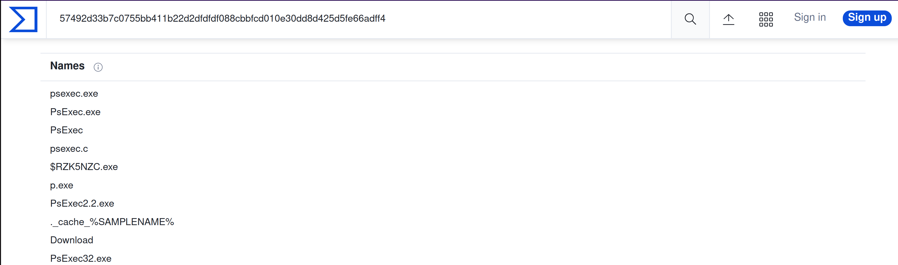

# IOC Search Collector Analysis

Scenario: You are assigned to do a threat hunting task at Osinski Inc. They believe there has been an intrusion, 
and the malicious actor was using the tool to perform the lateral movement attack, possibly a "pass-the-hash" attack.

Task: Can you find the file planted on the victim's computer using IOC Editor and Redline IOC Search Collector?

So far, you only know the following artifacts for the file:

File Strings:

    20210513173819Z0w0=
    <?<L<T<g=

File Size (Bytes):

    834936

Note: Open Previous Analysis, and use the existing Redline Session found in 
`C:\Users\Administrator\Documents\Analysis\Sessions\AnalysisSession1`

## Questions

**Provide the path of the file that matched all the artifacts along with the filename.**

Answer: `C:\Users\Administrator\AppData\Local\Temp\8eJv8w2id6lqN85dfC.exe`

**Provide the path where the file is located without including the filename.**

Answer: `C:\Users\Administrator\AppData\Local\Temp`

**Who is the owner of the file?**

Answer: `BUILTIN\Administrators`

**Provide the subsystem for the file.**

Answer: `WINDOWS_CUI`

**Provide the Device Path where the file is located.**

Answer: `\Device\HarddiskVolume2`

**Provide the hash (SHA-256) for the file.**

Use the `Get-FileHash` command.

Answer: `57492d33b7c0755bb411b22d2dfdfdf088cbbfcd010e30dd8d425d5fe66adff4`

**The attacker managed to masquerade the real filename. Can you find it having the hash in your arsenal?**

| 
|:--:|
| Answer: `psexec.exe` |

## Resources

* [Redline User Guide](https://www.fireeye.com/content/dam/fireeye-www/services/freeware/ug-redline.pdf)
* [IOC Editor User Guide](https://www.fireeye.com/content/dam/fireeye-www/services/freeware/ug-ioc-editor.pdf)

