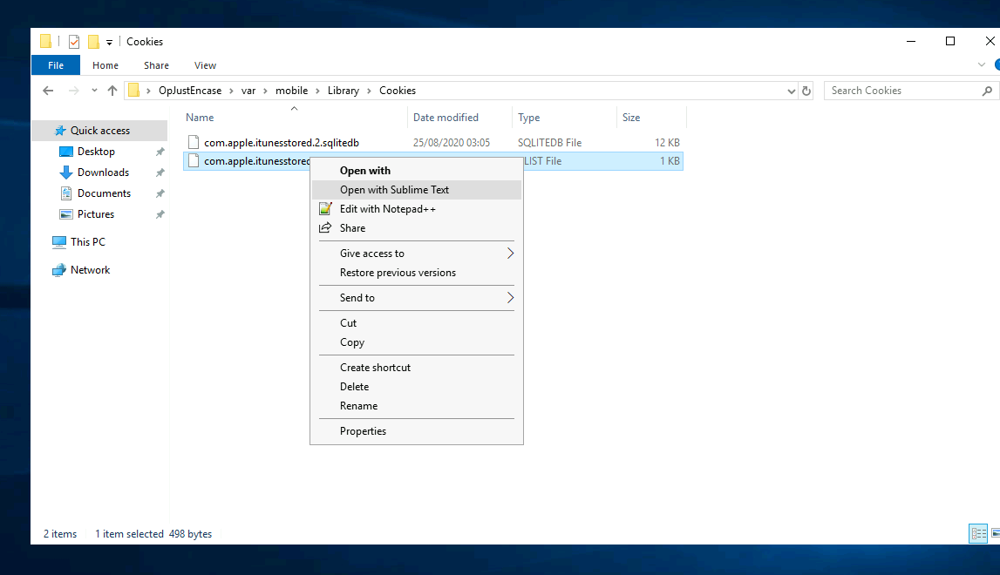

# iOS forensics

Applying the [fundamentals of iOS forensics](../notes/ios.md) for analysing an actual iPhone in "Operation JustEncase": 

Your crime taskforce has been investigating into the root cause of a recent outbreak of criminal activity. Although you've apprehended a Mr Brandon Hunter, you need to analyse the filesystem dump of his iPhone to find a lead into the gang.

Although the suspect's phone is locked with a passcode, you have been able to use a recent "Lockdown Certificate" from the suspect's computer, allowing you to create a [logical file system dump from an iPhone backup he made recently](../notes/ios-acquisition.md). 

----

Open DB Browser (SQLite), click on open database option and select `sms`, then `message`:

Who was the recipient of the SMS message sent on 23rd of August 2020? And what did the SMS message say?

Looking at the address book, what is the first name of the other person in the contacts? And what is their listed "Organization"?

Investigate their browsing history, what is the address of the website that they have bookmarked?

The suspect received an email, what is the `remote_id` of the sender?

What is the name of the company on one of the images stored on the suspects phone?

What is the value of the cookie that was left behind?

