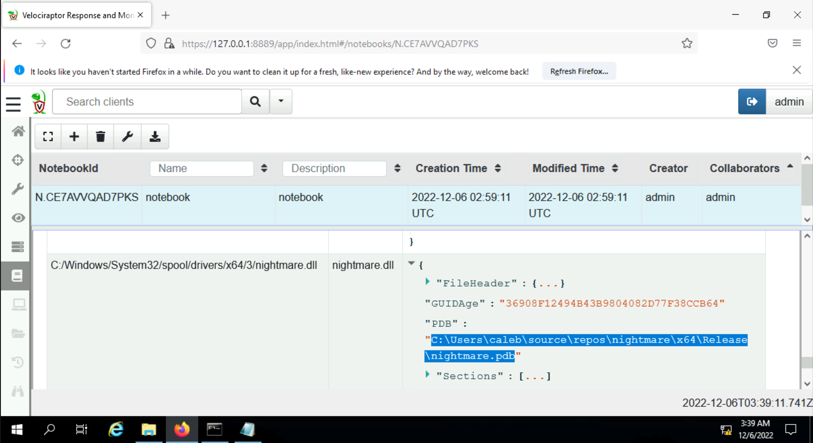

| 
|:--:|
| [THM Room: Velociraptor](https://tryhackme.com/room/velociraptorhp) |

# Hunt for a nightmare (Volatility)

Objective: Use Velociraptor to create an artifact to detect the PrintNightmare vulnerability!

Luckily there is an artifact entry in the Artifact Exchange. To avoid just copy/pasting the artifact, you will need to construct a very simple VQL query. 

Below are steps to construct your VQL query to find the DLL: 

* The `Select` clause, the column accessors should be fullpath (concatenate `C:/` to the fullpath column accessor) and filename. 
* Make sure the column headers for each column accessor are renamed. Fullpath should be `Full_Path`, and for filename it should be `File_Name`.
* Use `parse_pe()` to ensure only PE files are returned. (Check the [VQL Reference](https://docs.velociraptor.app/vql_reference/)) 
* Make sure the column header for this plugin should be renamed to PE. 
* The `From` clause should use `parse_mft()`.
* The `Where` clause should not return any directories, only return binaries (PE files) and search the directory where this malicious DLL will most likely be found.

Skeleton Query:

    SELECT "C:/" + FullPath AS *********,FileName AS *********,parse_pe(file="C:/" + FullPath) AS **
    FROM parse_mft(filename="C:/$***", accessor="****")
    WHERE *** IsDir
    AND FullPath =~ "Windows/System32/spool/drivers"
    AND **

Note: You will need to start Velociraptor in "Instant Velociraptor" mode. The instructions to do so can be found 
[here](https://docs.velociraptor.app/docs/deployment/#instant-velociraptor). The virtual machine attached to this 
task is running Velociraptor version 0.6.2.

Query:

    SELECT "C:/" + FullPath AS Full_Path,FileName AS File_Name,parse_pe(file="C:/" + FullPath) AS PE FROM parse_mft(filename="C:/$MFT", accessor="ntfs")
    WHERE NOT IsDir
        AND FullPath =~ "Windows/System32/spool/drivers"
        AND PE

## Questions

**What is the name in the Artifact Exchange to detect Printnightmare?**

`Windows.Detection.PrintNightmare`

**What is your Select clause? (no spaces after commas)**

`SELECT "C:/" + FullPath AS Full_Path,FileName AS File_Name,parse_pe(file="C:/" + FullPath) AS PE`

**What is the name of the DLL that was  placed by the attacker?** and **What is the PDB entry?**

| 
|:--:|
| `nightmare.dll` resp `C:\Users\caleb\source\repos\nightmare\x64\Release\nightmare.pdb` |

