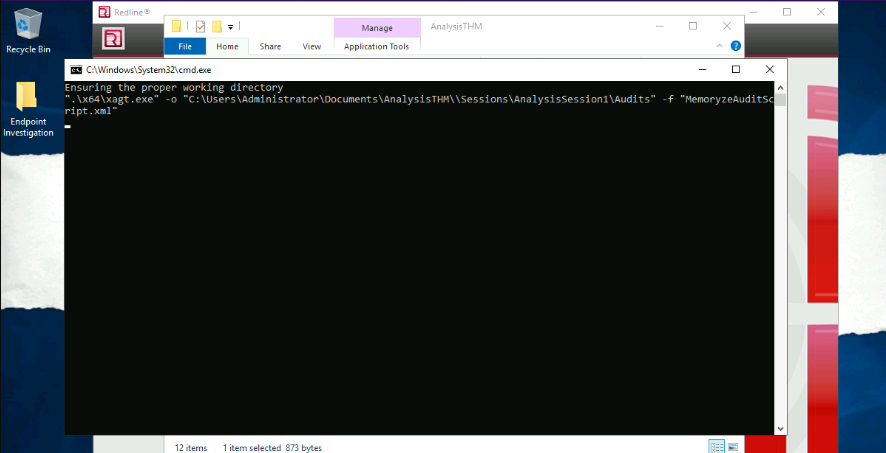

# Standard Collector Analysis (Redline)

Investigate an employee who is being accused of leaking private company data.

| 
|:--:|
| Taking AGES, this! |

## Questions

**Provide the Operating System detected for the workstation.**

Answer: `Windows Server 2019 Standard 17763`

**Provide the BIOS Version for the workstation.**

Answer: `Xen 4.2.amazon`

**What is the suspicious scheduled task that got created on the victim's computer?**

Answer: `MSOfficeUpdateFa.ke`

**Find the message that the intruder left for you in the task.**

Answer: `THM-p3R5IStENCe-m3Chani$m`

**There is a new System Event ID created by an intruder with the source name "THM-Redline-User" and the Type "ERROR". Find the Event ID #.**

Go to the `Event Logs` tab and filter for `THM-Redline-User` in the `Source` category:

Answer: `546`

**Provide the message for the Event ID.**

Answer: `Someone cracked my password. Now I need to rename my puppy-++-`

**It looks like the intruder downloaded a file containing the flag for Question 8. Provide the full URL of the website.**

Go to the `File Download History` tab and look for strange looking downloads:

Answer: `https://wormhole.app/download-stream/gI9vQtChjyYAmZ8Ody0AuA`

**Provide the full path to where the file was downloaded to including the filename.**

Answer: `C:\Program Files (x86)\Windows Mail\SomeMailFolder\flag.txt`

**Provide the message the intruder left for you in the file.**

Go there and open it in `Notepad`:

Answer: `THM{600D-C@7cH-My-FR1EnD}`

## Resources

* [Redline User Guide](https://www.fireeye.com/content/dam/fireeye-www/services/freeware/ug-redline.pdf)

