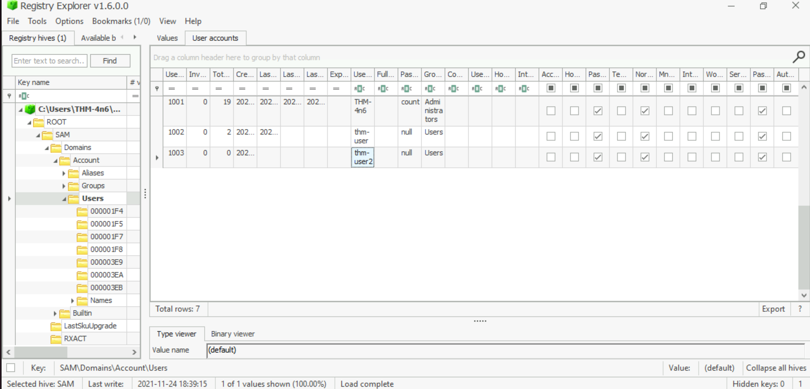
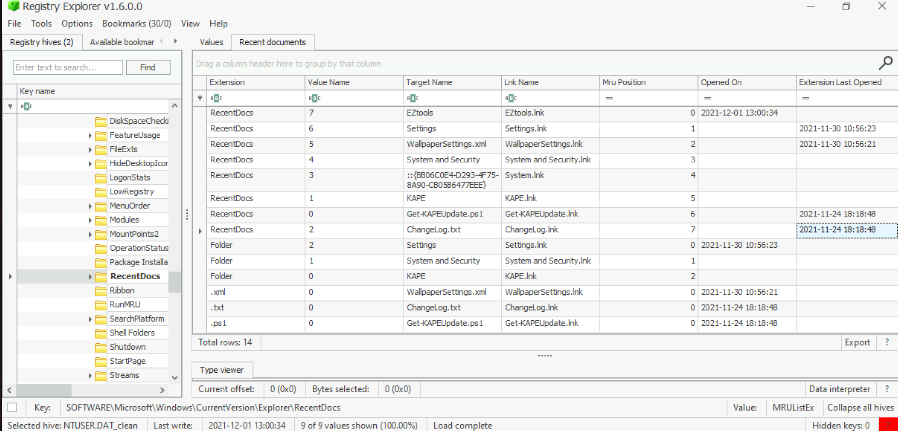
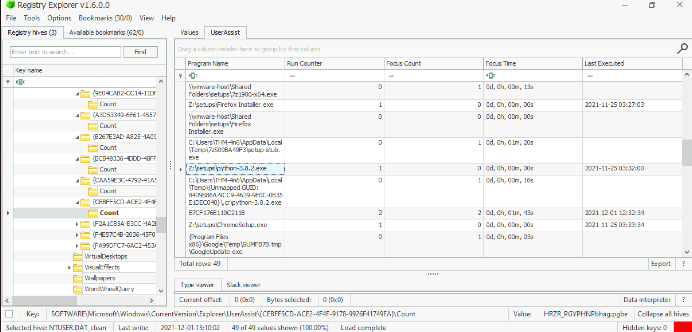
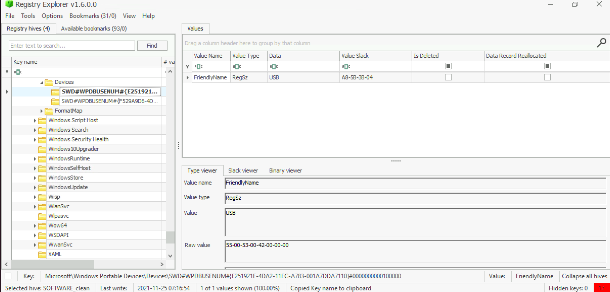
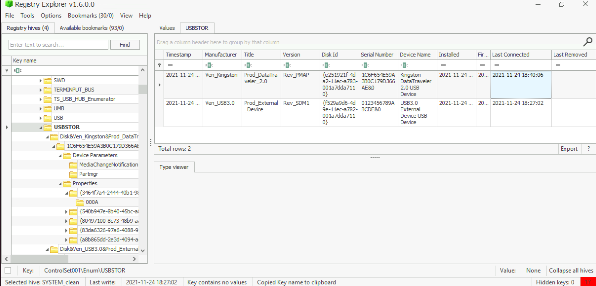

# Organisation X desktop

One of the Desktops in the research lab at Organisation X is suspected to have been accessed by someone unauthorized. 
Although they generally have only one user account per Desktop, there were multiple user accounts observed on this 
system. It is also suspected that the system was connected to some network drive, and a USB device was connected to 
the system. The triage data from the system was collected and placed on the attached VM. Can you help 
Organisation X with finding answers to the below questions?

Note: When loading registry hives in RegistryExplorer, it will caution us that the hives are dirty. Point 
`RegistryExplorer` to the `.LOG1` and `.LOG2` files with the same filename as the registry hive. It will automatically 
integrate the transaction logs and create a 'clean' hive. Once we tell `RegistryExplorer` where to save the clean 
hive, we can use that for our analysis, and we won't need to load the dirty hives anymore. 
`RegistryExplorer` will guide you through this process.

**How many user created accounts are present on the system?**

| 
|:--:|
| Answer: `3` |

**What is the username of the account that has never been logged in?**

Answer: `thm-user2`

**What's the password hint for the user THM-4n6?**

Answer: `count`

**When was the file 'Changelog.txt' accessed?**

| 
|:--:|
| Answer: `2021-11-24 18:18:48` |

**What is the complete path from where the python 3.8.2 installer was run?**

| 
|:--:|
| Answer: `Z:\setups\python-3.8.2.exe` |

**When was the USB device with the friendly name 'USB' last connected?**

| 
|:--:|
| Get the GUID. |

Load the `SYSTEM` hive and clean it:

| 
|:--:|
| Answer: `2021–11–24 18:40:06` |

