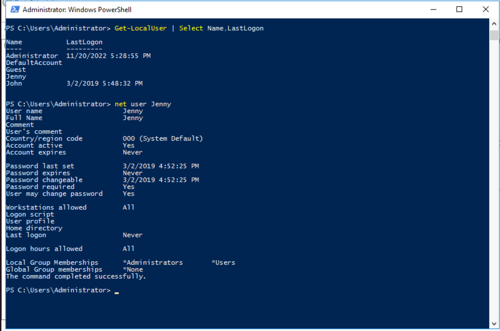
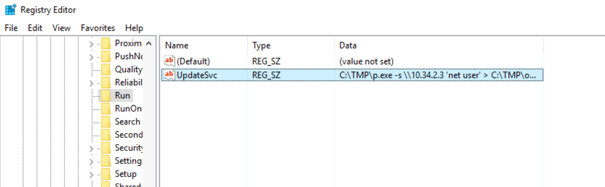
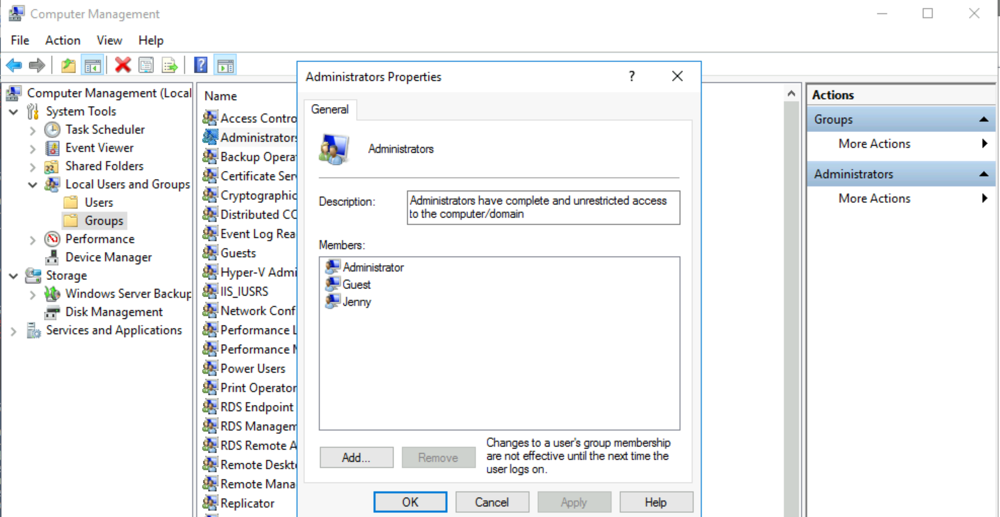
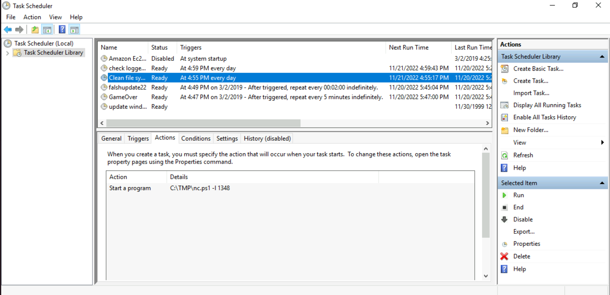
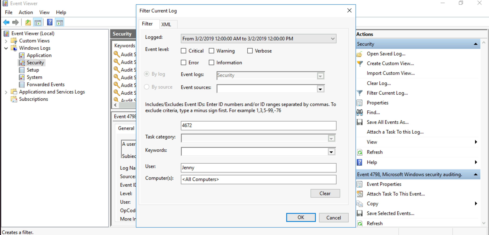
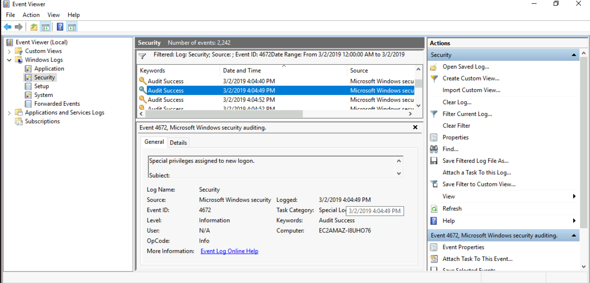
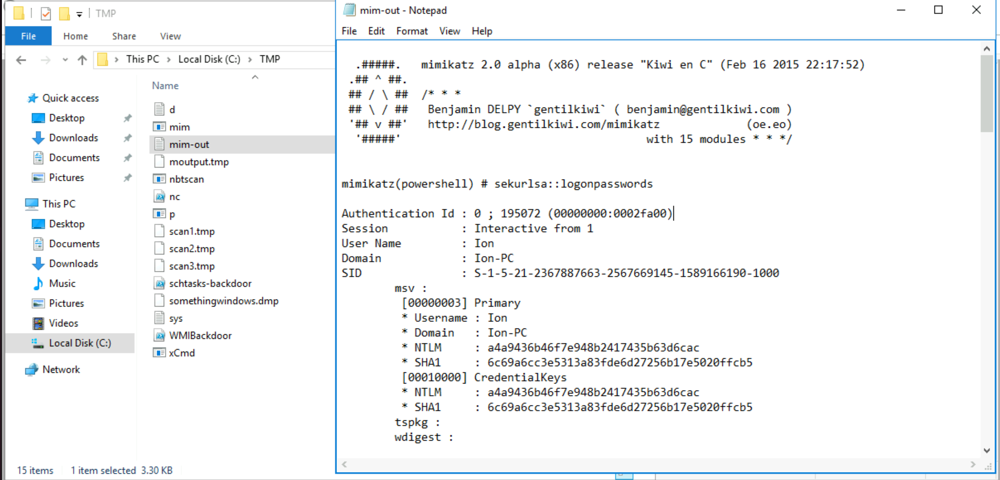
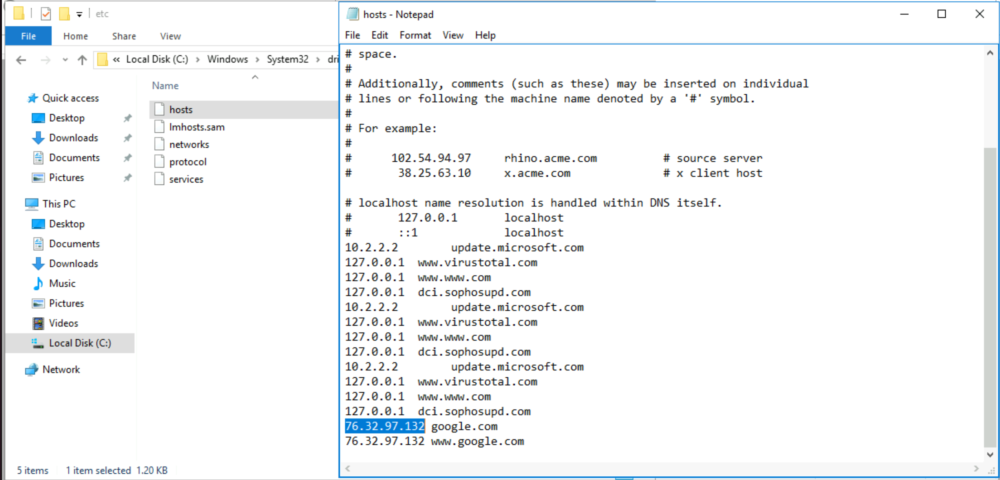
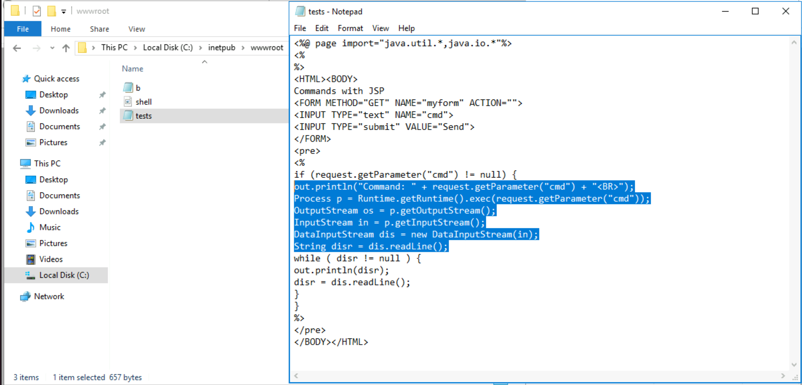
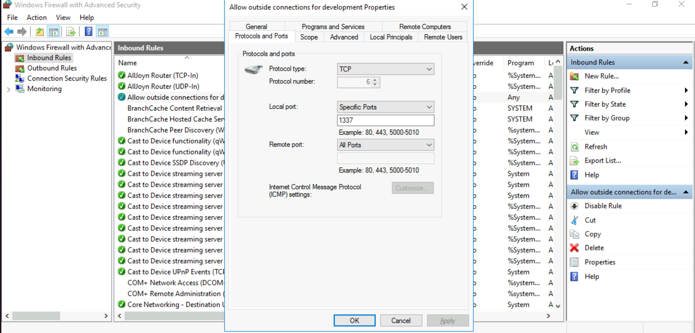

# A Windows server

**What is the version and year of the Windows machine?**

Answer: `Windows Server 2016`

**Which user logged in last?**

| 
|:--:|
| Answer: `Administrator` |

**When did John log onto the system last? Answer format: MM/DD/YYYY H:MM:SS AM/PM**

Answer: `03/02/2019 5:48:32 PM`

**What IP does the system connect to when it first starts?**

| 
|:--:|
| Answer: `10.34.2.3`  |

**What two accounts had administrative privileges (other than the Administrator user)? Answer format: username1, username2**

| 
|:--:|
| Answer: `Jenny,Guest`  |

**What is the name of the scheduled task that is malicious.**

| 
|:--:|
| Answer: `Clean file system`  |

**What file was the task trying to run daily?**

Answer: `nc.ps1`

**What port did this file listen locally for?**

Answer: `1348`

**When did Jenny last logon?**

Answer: `Never`

**At what date did the compromise take place? Answer format: MM/DD/YYYY**

Answer: `03/02/2019`

**At what time did Windows first assign special privileges to a new logon? Answer format: MM/DD/YYYY HH:MM:SS AM/PM**

| 
|:--:|
| Filter in Windows Security logs in a time frame and [event 4672](https://learn.microsoft.com/en-us/windows/security/threat-protection/auditing/event-4672) |

Then find the event using the hint: `00/00/0000 0:00:49 PM`

| 
|:--:|
| Answer: `03/02/2019 04:04:49 PM` |

**What tool was used to get Windows passwords?**

| 
|:--:|
| Answer: `Mimikatz` |

**What was the attackers external control and command servers IP?**

| 
|:--:|
| Answer: `76.32.97.132` |

**What was the extension name of the shell uploaded via the servers' website?**

| 
|:--:|
| Answer: `.jsp` |

**What was the last port the attacker opened?**

| 
|:--:|
| Answer: `1337` |

**Check for DNS poisoning, what site was targeted?**

Answer: `google.com`
