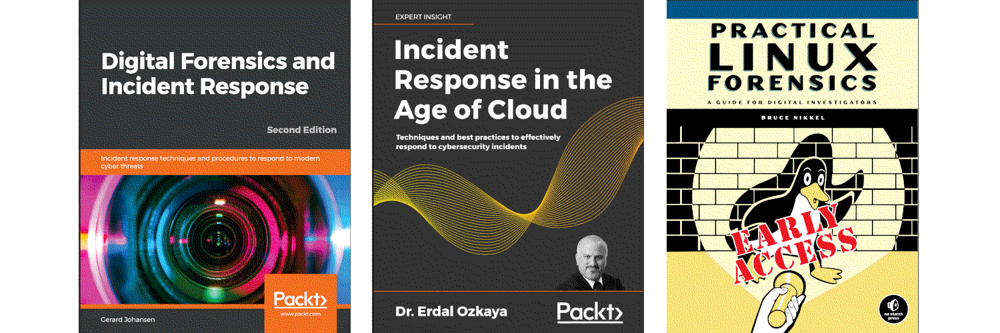

Digital forensics and incident response
===========================================================

Memory forensics ties into many disciplines in cyber investigations. From the classical investigations that focus on
user artifacts via malware analysis to large-scale hunting, memory forensics has many applications in security
operations.

----

----

.. toctree::
   :glob:
   :maxdepth: 1
   :includehidden:
   :caption: Windows forensics

   docs/windows/README.md
   docs/windows/server.md
   docs/windows/desktop.md

.. toctree::
   :glob:
   :maxdepth: 1
   :includehidden:
   :caption: Linux forensics

   docs/linux/README.md
   docs/linux/persistence.md
   docs/linux/execution.md
   docs/linux/logs.md

.. toctree::
   :glob:
   :maxdepth: 1
   :includehidden:
   :caption: RedLine

   docs/redline/README.md
   docs/redline/standard.md
   docs/redline/ioc-collector.md
   docs/redline/ioc-analysis.md
   docs/redline/endpoint.md

.. toctree::
   :glob:
   :maxdepth: 1
   :includehidden:
   :caption: Tools in a nutshell

   docs/nutshells/README.md
   docs/nutshells/autopsy.md
   docs/nutshells/kape.md
   docs/nutshells/volatility.md
   docs/nutshells/velociraptor.md
   docs/nutshells/thehive.md

.. toctree::
   :glob:
   :maxdepth: 1
   :includehidden:
   :caption: Challenges

   docs/challenges/README.md
   docs/challenges/leaky.md
   docs/challenges/windows10.md
   docs/challenges/policy.md
   docs/challenges/bob.md
   docs/challenges/feelings.md
   docs/challenges/nightmare.md

.. toctree::
   :caption: Links

   Blue Team <https://blue.tymyrddin.dev/>