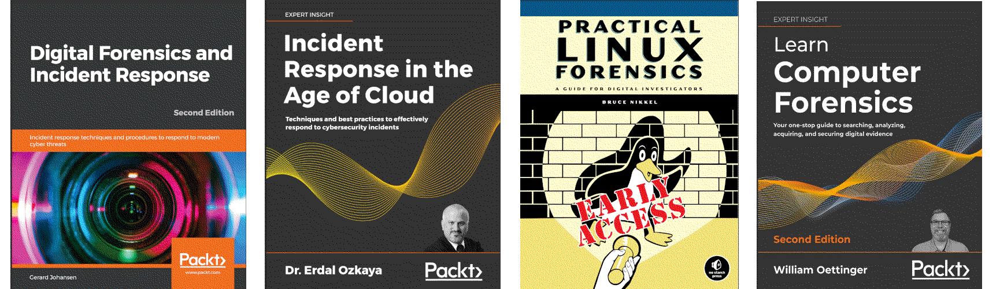

Digital forensics and incident response (DFIR)
===========================================================

Memory forensics ties into many disciplines in cyber investigations. From the classical investigations that focus on user artifacts via malware analysis to large-scale hunting, memory forensics has many applications in security operations.

Though DFIR is traditionally a reactive security function, tooling and advanced technology such as artificial intelligence (AI) and machine learning (ML), have enabled some organisations to leverage DFIR activity to influence and inform preventative measures. In such cases, making it a component within a proactive security strategy.

----

.. toctree::
   :maxdepth: 1
   :includehidden:
   :caption: Testlab

   Forensics and incident response tools <https://blue.tymyrddin.dev/projects/testlab/en/latest/docs/dfir/README.html>

----

.. toctree::
   :glob:
   :maxdepth: 1
   :includehidden:
   :caption: Notes on techniques

   docs/notes/README.md
   docs/notes/linux.md

----

.. toctree::
   :glob:
   :maxdepth: 1
   :includehidden:
   :caption: TryHackMe rooms

   docs/thm/README.md
   docs/thm/server.md
   docs/thm/desktop.md
   docs/thm/standard.md
   docs/thm/ioc-collector.md
   docs/thm/ioc-analysis.md
   docs/thm/endpoint.md
   docs/thm/leaky.md
   docs/thm/windows10.md
   docs/thm/policy.md
   docs/thm/bob.md
   docs/thm/feelings.md
   docs/thm/nightmare.md

----

